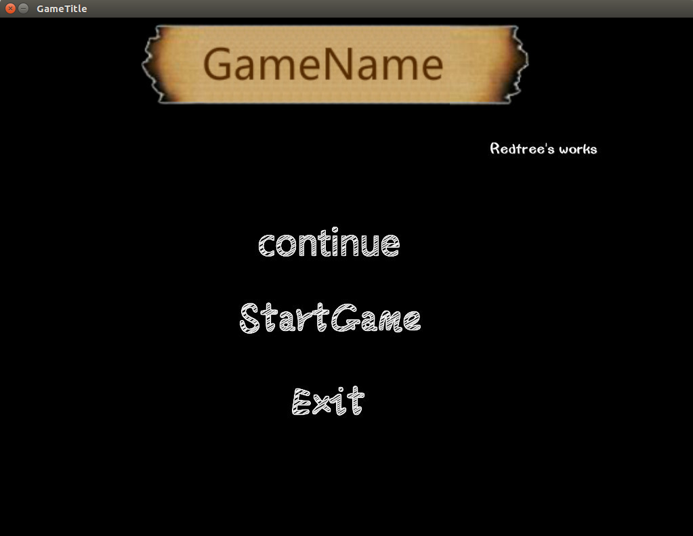
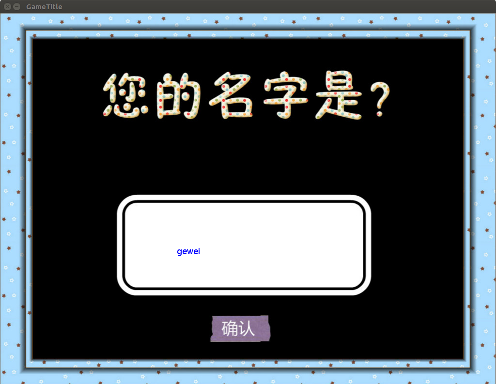
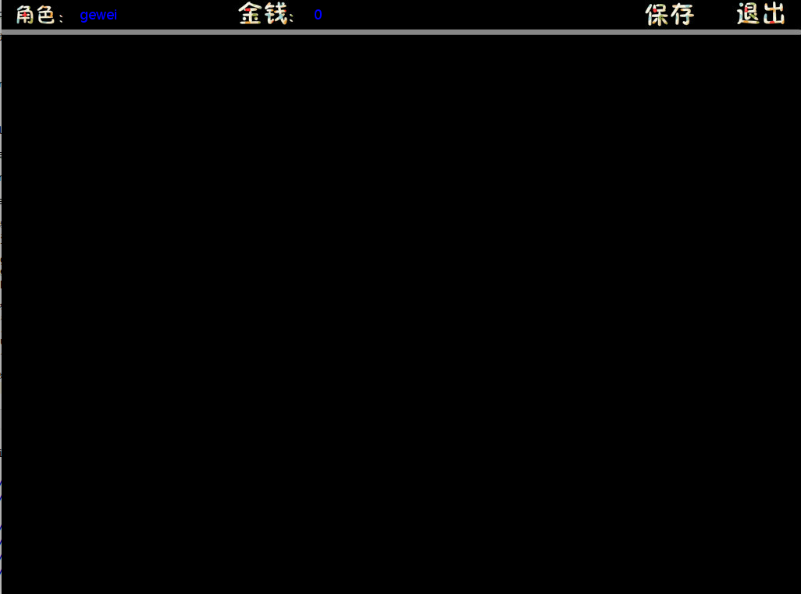

简介：

这是一个基于lua语言，love2d引擎技术，重新架构开发的一个用于模拟经营类游戏框架。目前没有具体的游戏策划方案，仅处于核心api封装和功能调试阶段。

感兴趣的小伙伴可以给联系我qq 1984573707 , 喜欢的给个STAR~~谢谢

src

---

perfectfile.love 游戏主体源码

core 引擎核心API封装

gdata 游戏基础数据和存档数据定义

resource 多媒体资源

utils 数学方法和数据处理的函数库

conf.lua 窗口设置

eventer 事件逻辑处理模块 对应love.update函数块

loader 预加载模块 对应 love.load

painter 对应 love.draw

业务开发逻辑：

1 现将游戏素材拷贝至resource下的关联目录下

2 通过loader初始化加载资源

3 通过gdata/gamedata , gdata/basedata 配置新的游戏数据属性（系统/角色）

4 通过eventer配置游戏的业务更新逻辑，事件触发逻辑。 控制场景和状态值的转换与游戏数据的处理。 （游戏核心逻辑模块1）

5 通过painter结合loader里当前的业务场景和状态进行绘画。（游戏核心逻辑模块2）

已实现功能

1 自动检测识别存档文件，并在标题业作相应状态控制

2 支持用户输入（仅限英文），用户可为自己的角色命名。

3 支持utf8和中文输出。

4 支持存档和读档功能

后续计划:
暂无

